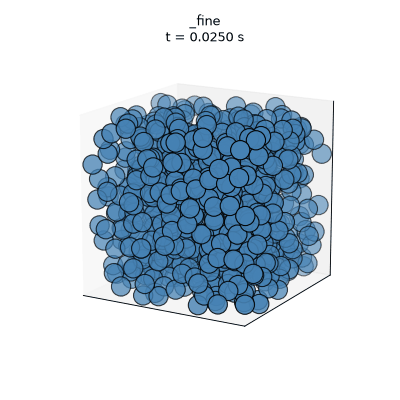
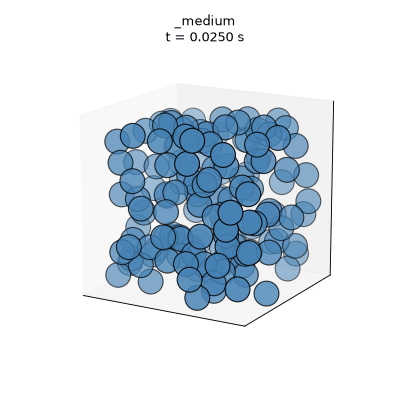
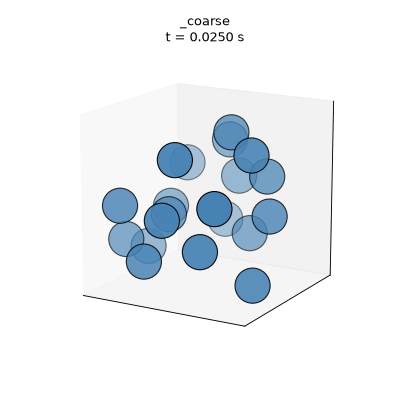
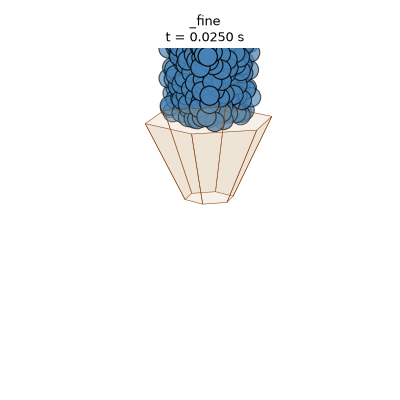
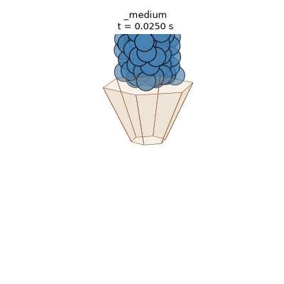
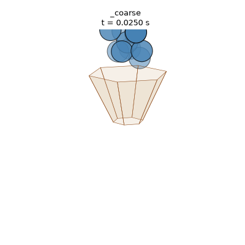

# dem-granular-flow
DEM simulations of granular flow, exploring how particle size affects jamming. Built for a public outreach demo.

<p align="center">
  
  
  
</p>

<p align="center">
  
  
  
</p>

## Quick start
Simulations are run via YADE in Docker. There are two main types of simulations: dropping particles into a cube, and dropping particles into a funnel-shaped hopper. The scripts are in `scripts/` and the output is written to `output/`. The bash scripts `run_cube_sim.sh` and `run_hopper_sim.sh` run the simulations with the parameters set in the scripts. GIFs are automatically generated from the output frames using Python scripts in `analysis/`.

1. Install Docker Desktop and launch it once to finish its first-run setup.
2. Python venv (for analysis scripts)
    - On Mac/Linux:
    ```bash 
      python3.13 -m venv venv
      source venv/bin/activate
      pip install -r requirements.txt
    ```
    - On Windows, 
    ```bash 
      python -m venv venv
      venv\Scripts\activate.bat
      pip install -r requirements.txt
    ```
3. Run simulations (YADE via Docker)
    - `./run_cube_sim.sh` - drops particles into a cube
    - `./run_hopper_sim.sh` - drops particles into a funnel-shaped hopper

## Customizing simulations

Simulation parameters are set in the scripts in `scripts/`. The main parameters to explore, common to both simulations, are:
- `RUN_NAME` - name of the run (used for output file names)
- `R_MEAN` - mean particle radius (m)
- `R_REL_FUZZ` - relative fuzziness of particle radius (0 = all the same size, 1 = uniform distribution from 0 to 2*R_MEAN)
- `NUM_PARTICLES` - number of particles to drop (affects total volume of particles)

`scripts/cube_granules.py` also accepts:
- `BOX_SIZE` - comma-separated x,y,z dimensions of the box (m), e.g. `0.1,0.1,0.1`

`scripts/hopper_granules.py` also accepts:
- `TOP_DIAMETER` - width of the wide top opening (m)
- `APERTURE_DIAMETER` - width of the narrow bottom opening (m)
- `HOPPER_HEIGHT` - vertical drop from the top opening to the aperture (m)
- `N_SIDES` - number of sides of the hopper's polygonal cross-section (6 = hexagonal)
- `SIM_DURATION` - simulated seconds to run before stopping

## Outputs

`scripts/cube_granules.py` drops a cloud of spheres into a box under
gravity so you can explore how particle size/spread affects jamming. Each run
writes to several files to the `output/` folder
- `packing_<run_name>.txt` - packing fraction vs. iteration
- `frames/<run_name>/t_<time>.txt` — per-particle x/y/z/radius snapshots
- `summary.csv` — one row per run (particle size + final packing fraction)

`scripts/hopper_granules.py` drops a cloud of spheres into a funnel-shaped hopper under gravity so you can explore how particle size/spread affects jamming during discharge. Each run writes to the `output/` folder
- `frames/_hopper<run_name>/t_<time>.txt` — per-particle x/y/z/radius snapshots
- `hopper_summary.csv` — one row per run (hopper geometry, particle count, final discharged count, whether it jammed)

## Analyzing results
With the venv from the Quick start section activated, a couple of standalone
scripts help compare runs beyond the GIFs that `run_cube_sim.sh`/
`run_hopper_sim.sh` already generate:

    python analysis/plot_packing.py <run_name>   # cube: packing fraction vs. time
    python analysis/compare_packing.py            # cube: packing density vs. particle size,
                                                   # across all rows in output/summary.csv

## Notes

On Apple Silicon you'll see a `platform (linux/amd64) does not match ...`
warning. YADE has no arm64 image, so Docker runs it emulated (works fine,
just slower). Add `--platform linux/amd64` after `docker run --rm` to silence
the warning: it doesn't change performance.